# Table of contents

* [About Campus Jam](#about-campus-jam)
* [Installation](#installation)
* [Application design](#application-design)
  * [Directory structure](#directory-structure)
  * [Import conventions](#import-conventions)
  * [Naming conventions](#naming-conventions)
  * [CSS](#css)
  * [Routing](#routing)
  * [Authentication](#authentication)
  * [Authorization](#authorization)
  * [Configuration](#configuration)
  * [Quality Assurance](#quality-assurance)
    * [ESLint](#eslint)
  * [Initial User Study](#initial-user-study)
* [Development history](#development-history)
  * [Milestone 1: Mockup development](#milestone-1-mockup-development)
  * [Milestone 2: UH CAS and Page Functionality](#milestone-2-uh-cas-and-page-functionality)
  * [Milestone 3: Collections and Page Functionality](#milestone-3-collections-and-page-functionality)


# About Campus Jam

Campus Jam is a Meteor application providing musical profiles for the University of Hawaii community.

This app is running on [Meteor](http://campusjam.meteorapp.com/).

Upon arrival of the site, you will be greeted by the following landing page:
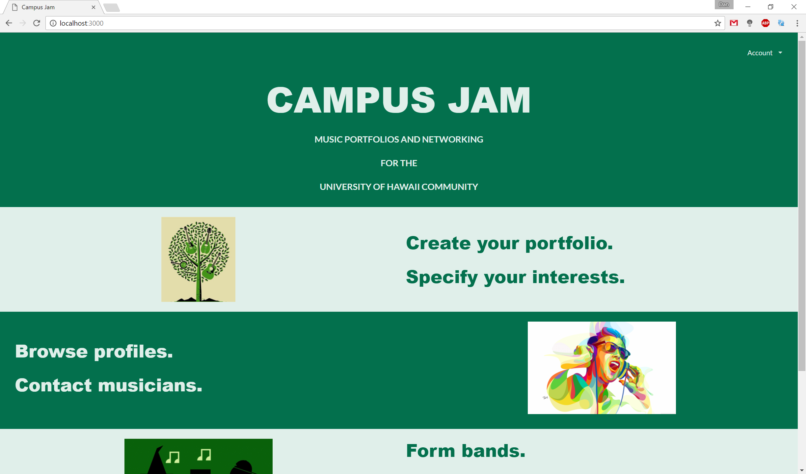

Anyone with a UH account can login to Campus Jam by clicking on the login button. The UH CAS authentication screen then appears and requests your UH account and password:

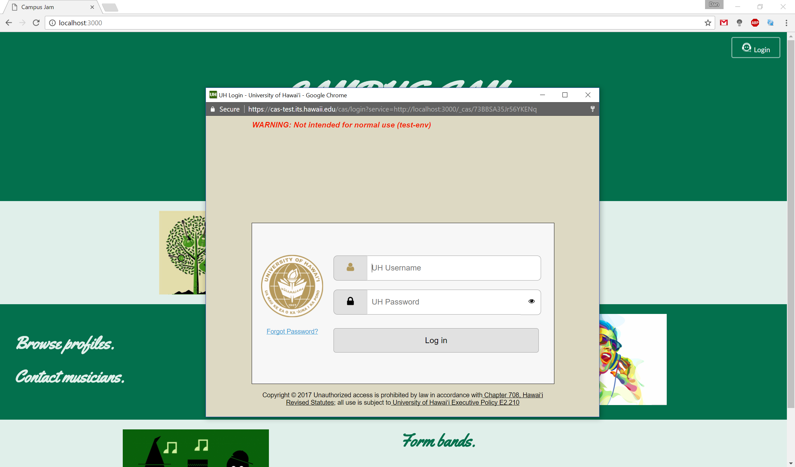

After logging in, you will be greeted with your home page which displays events you created or joined, recommended users with same tastes, goals, or capabilities, and upcoming events you might be interested in:

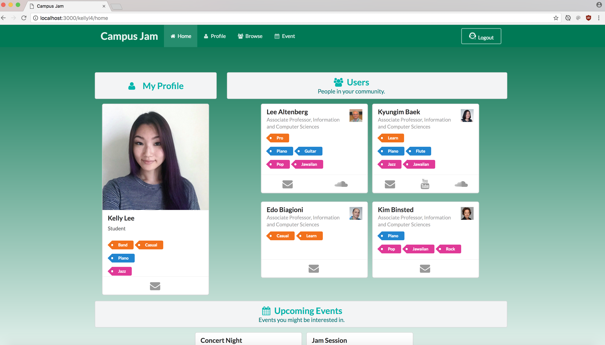

You can create or edit your profile that provides your contact info, tastes, capabilities, goals, and links to YouTube and SoundCloud if you have them:

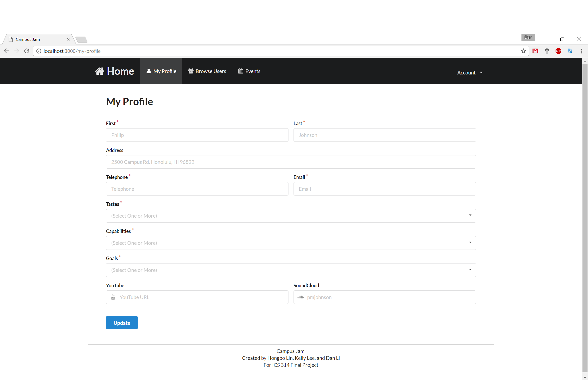

You can browse for users by filtering tastes, capabilities, and goals:

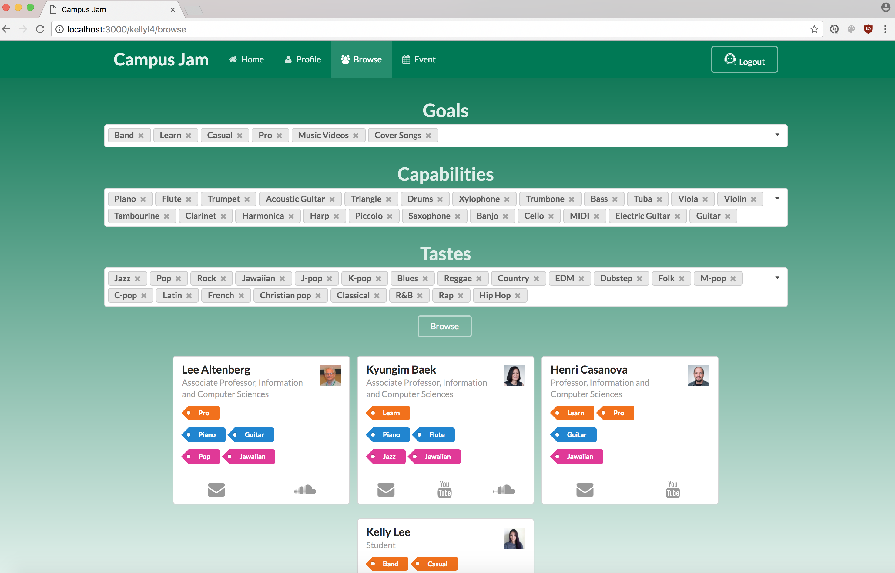

You can create events in the events page:

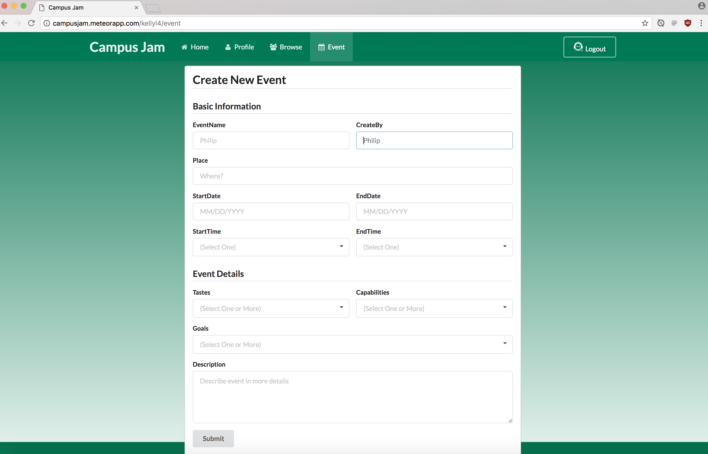

# Installation

First, [install Meteor](https://www.meteor.com/install).

Second, [download a copy of Campus Jam](https://github.com/campusjam/campusjam/archive/master.zip), or clone it using git.

Third, cd into the app/ directory and install libraries with:

```
$ meteor npm install
```

Fourth, run the system with:

```
$ meteor npm run start
```

If all goes well, the application will appear at [http://localhost:3000](http://localhost:3000). If you have an account on the UH test CAS server, you can login.  

# Application Design

## Directory structure

The top-level directory structure contains:

```
app/        # holds the Meteor application sources
config/     # holds configuration files, such as settings.development.json
.gitignore  # don't commit IntelliJ project files, node_modules, and settings.production.json
```

This structure separates configuration files (such as the settings files) in the config/ directory from the actual Meteor application in the app/ directory.

The app/ directory has this top-level structure:

```
client/
  lib/           # holds Semantic UI files.
  head.html      # the <head>
  main.js        # import all the client-side html and js files.

imports/
  api/           # Define collection processing code (client + server side)
    base/
    capability/
    goal/
    profile/
    taste/
  startup/       # Define code to run when system starts up (client-only, server-only)
    client/        
    server/        
  ui/
    components/  # templates that appear inside a page template.
    layouts/     # Layouts contain common elements to all pages (i.e. menubar and footer)
    pages/       # Pages are navigated to by FlowRouter routes.
    stylesheets/ # CSS customizations, if any.

node_modules/    # managed by Meteor

private/
  database/      # holds the JSON file used to initialize the database on startup.

public/          
  images/        # holds static images for landing page and predefined sample users.

server/
   main.js       # import all the server-side js files.
```

## Import conventions

This system adheres to the Meteor 1.4 guideline of putting all application code in the imports/ directory, and using client/main.js and server/main.js to import the code appropriate for the client and server in an appropriate order.

This system accomplishes client and server-side importing in a different manner than most Meteor sample applications. In this system, every imports/ subdirectory containing any Javascript or HTML files has a top-level index.js file that is responsible for importing all files in its associated directory.   

Then, client/main.js and server/main.js are responsible for importing all the directories containing code they need. For example, here is the contents of client/main.js:

```
import '/imports/startup/client';
import '/imports/ui/components/form-controls';
import '/imports/ui/components/directory';
import '/imports/ui/components/user';
import '/imports/ui/components/landing';
import '/imports/ui/layouts/directory';
import '/imports/ui/layouts/landing';
import '/imports/ui/layouts/shared';
import '/imports/ui/layouts/user';
import '/imports/ui/pages/directory';
import '/imports/ui/pages/browse';
import '/imports/ui/pages/landing';
import '/imports/ui/pages/user';
import '/imports/ui/pages/home';
import '/imports/ui/pages/event';
import '/imports/api/base';
import '/imports/api/profile';
import '/imports/api/goal';
import '/imports/api/capability';
import '/imports/api/taste';
import '/imports/ui/stylesheets/style.css';
```

Apart from the last line that imports style.css directly, the other lines all invoke the index.js file in the specified directory.

We use this approach to make it more simple to understand what code is loaded and in what order, and to simplify debugging when some code or templates do not appear to be loaded.  In our approach, there are only two places to look for top-level imports: the main.js files in client/ and server/, and the index.js files in import subdirectories.

Note that this two-level import structure ensures that all code and templates are loaded, but does not ensure that the symbols needed in a given file are accessible.  So, for example, a symbol bound to a collection still needs to be imported into any file that references it.

## Naming conventions

This system adopts the following naming conventions:

  * Files and directories are named in all lowercase, with words separated by hyphens. Example: accounts-config.js
  * "Global" Javascript variables (such as collections) are capitalized. Example: Profiles.
  * Other Javascript variables are camel-case. Example: collectionList.
  * Templates representing pages are capitalized, with words separated by underscores. Example: Directory_Page. The files for this template are lower case, with hyphens rather than underscore. Example: directory-page.html, directory-page.js.
  * Routes to pages are named the same as their corresponding page. Example: Directory_Page.

## CSS

The application uses the [Semantic UI](http://semantic-ui.com/) CSS framework. To learn more about the Semantic UI theme integration with Meteor, see [Semantic-UI-Meteor](https://github.com/Semantic-Org/Semantic-UI-Meteor).

The Semantic UI theme files are located in [app/client/lib/semantic-ui](https://github.com/campusjam/campusjam/tree/master/app/client/lib/semantic-ui) directory. Because they are located in the client/ directory and not the imports/ directory, they do not need to be explicitly imported to be loaded. (Meteor automatically loads all files into the client that are located in the client/ directory).

Note that the user pages contain a menu fixed to the top of the page, and thus the body element needs to have padding attached to it.  However, the landing page does not have a menu, and thus no padding should be attached to the body element on that page. To accomplish this, the [router](https://github.com/campusjam/campusjam/blob/master/app/imports/startup/client/router.js) uses "triggers" to add an remove the appropriate classes from the body element when a page is visited and then left by the user.

## Routing

For display and navigation among its five pages, the application uses [Flow Router](https://github.com/kadirahq/flow-router).

Routing is defined in [imports/startup/client/router.js](https://github.com/campusjam/campusjam/blob/master/app/imports/startup/client/router.js).

Campus Jam defines the following routes:

  * The `/` route goes to the public landing page.
  * The `/home` route goes to your home page.
  * The `/profile` route goes to the profile page.
  * The `/browse` route goes to the page to browse fellow users.
  * The `/event` route goes to the page to create and browse events.

## Authentication

For authentication, the application uses the University of Hawaii CAS test server, and follows the approach shown in [meteor-example-uh-cas](http://ics-software-engineering.github.io/meteor-example-uh-cas/).

When the application is run, the CAS configuration information must be present in a configuration file such as  [config/settings.development.json](https://github.com/ics-software-engineering/meteor-application-template/blob/master/config/settings.development.json).

Anyone with a UH account can login and use Campus Jam to create a portfolio.  A profile document is created for them if none already exists.

## Authorization

The landing and directory pages are public; anyone can access those pages.

The profile and filter pages require authorization: you must be logged in (i.e. authenticated) through the UH test CAS server, and the authenticated username returned by CAS must match the username specified in the URL.  So, for example, only the authenticated user `johnson` can access the pages `http://localhost:3000/johnson/profile` and  `http://localhost:3000/johnson/filter`.

To prevent people from accessing pages they are not authorized to visit, template-based authorization is used following the recommendations in [Implementing Auth Logic and Permissions](https://kadira.io/academy/meteor-routing-guide/content/implementing-auth-logic-and-permissions).

The application implements template-based authorization using an If_Authorized template, defined in [If_Authorized.html](https://github.com/campusjam/campusjam/blob/master/app/imports/ui/layouts/if-authorized.html) and [If_Authorized.js](https://github.com/campusjam/campusjam/blob/master/app/imports/ui/layouts/if-authorized.js).

## Configuration

The [config](https://github.com/campusjam/campusjam/tree/master/config) directory is intended to hold settings files.  The repository contains one file: [config/settings.development.json](https://github.com/campusjam/campusjam/blob/master/config/settings.development.json).

The [.gitignore](https://github.com/campusjam/campusjam/blob/master/.gitignore) file prevents a file named settings.production.json from being committed to the repository. So, if you are deploying the application, you can put settings in a file named settings.production.json and it will not be committed.

Campus Jam checks on startup to see if it has an empty database in [initialize-database.js](https://github.com/campusjam/campusjam/blob/master/app/imports/startup/server/initialize-database.js), and if so, loads the file specified in the configuration file, such as [settings.development.json](https://github.com/campusjam/campusjam/blob/master/config/settings.development.json).  For development purposes, a sample initialization for this database is in [initial-collection-data.json](https://github.com/campusjam/campusjam/blob/master/app/private/database/initial-collection-data.json).

## Quality Assurance

### ESLint

Campus Jam includes a [.eslintrc](https://github.com/campusjam/campusjam/blob/master/app/.eslintrc) file to define the coding style adhered to in this application. You can invoke ESLint from the command line as follows:

```
meteor npm run lint
```

ESLint should run without generating any errors.  

It's significantly easier to do development with ESLint integrated directly into your IDE (such as IntelliJ).

## Initial User Study

For this initial user study, we gathered five students that attended University of Hawaii and had working UH accounts in order to log in and access the application.

The reviews mostly touched upon the user friendliness of the interface and the relative difficulty of understanding the purpose of using such an application. All reviewers recommended that a new banner image for the application be chosen as the current one is still rather bloated and detracts from the overall aesthetics of the application. However, they liked the simplicity of the navigation menu and liked having everything laid out in front of them.

The reviewers thought that they liked the concept and intended use of the application and approved of the ability to "follow" a user in order to keep track of musicians and make friends. They recommended that the navigation should be placed at the top and that the picture was rather distracting. They also recommended that there be a announcements page that they should land in first to see any updated content. They would also like to see a forum implemented so that others could talk and hang out online. There should also be a specific area dedicated to technical support, which could be implemented into the forum.

# Development History

The development process for Campus Jam conformed to [Issue Driven Project Management](http://courses.ics.hawaii.edu/ics314s17/modules/project-management/) practices. In a nutshell, development consists of a sequence of Milestones. Milestones consist of issues corresponding to 2-3 day tasks. GitHub projects are used to manage the processing of tasks during a milestone.  

The following sections document the development history of Campus Jam.

## Milestone 1: Mockup development

This milestone started on March 29, 2016 and ended on April 13, 2017.

The goal of Milestone 1 was to create a set of HTML pages providing a mockup of the pages in the system. To simplify things, the mockup was developed as a Meteor app. This meant that each page was a template and that FlowRouter was used to implement routing to the pages.

Mockups for the following five pages were implemented during M1:


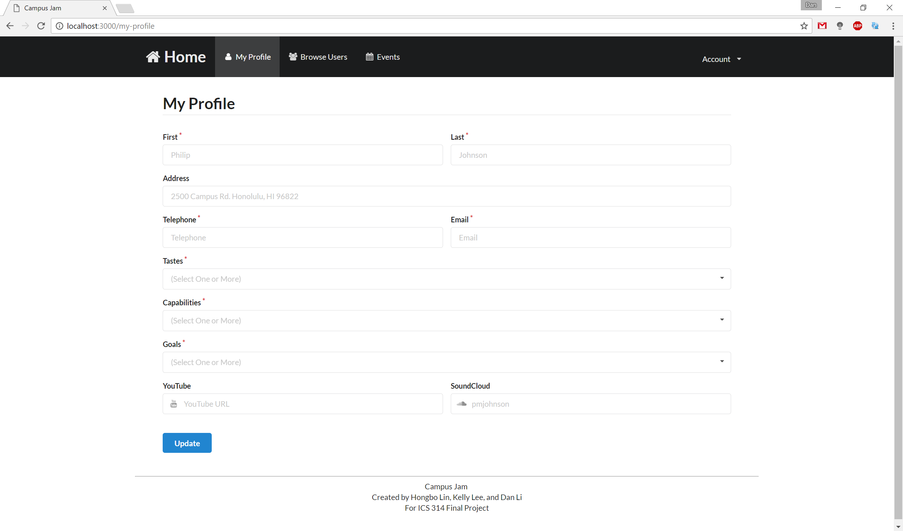

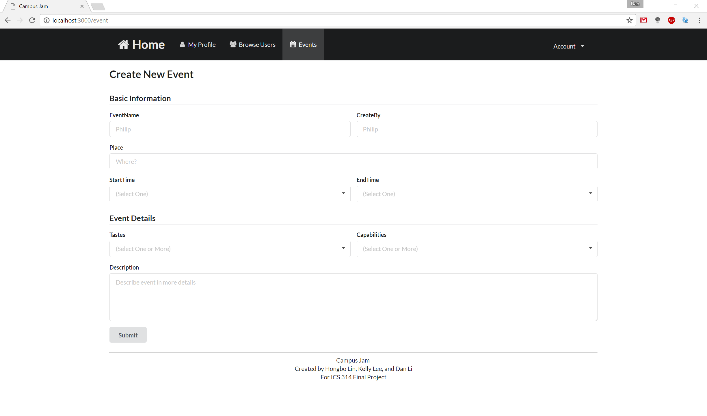


Milestone 1 was implemented as [Campus Jam GitHub Milestone M1](https://github.com/campusjam/campusjam/milestone/1):

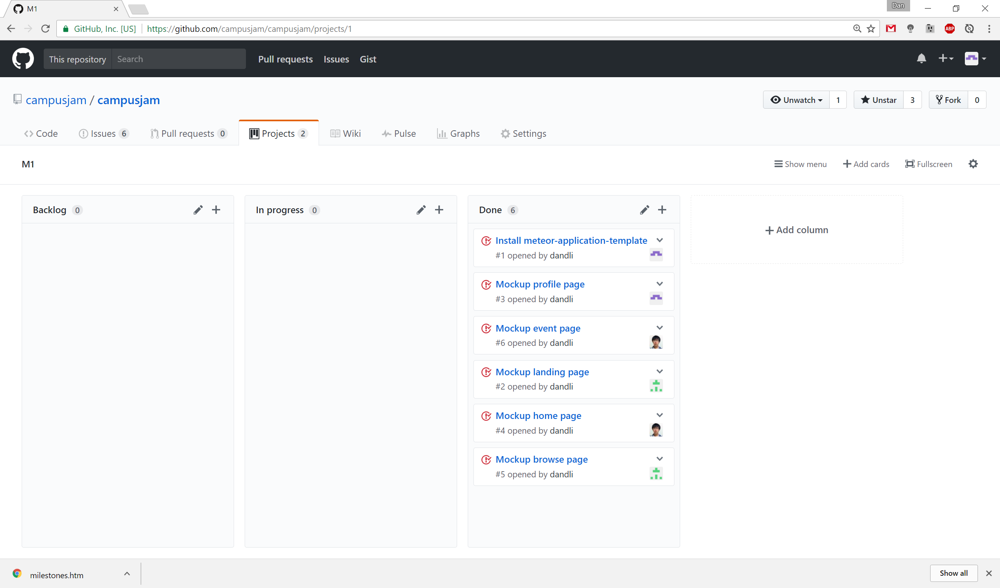

Milestone 1 consisted of six issues, and progress was managed via the [Campus Jam GitHub Project M1](https://github.com/campusjam/campusjam/projects/1):

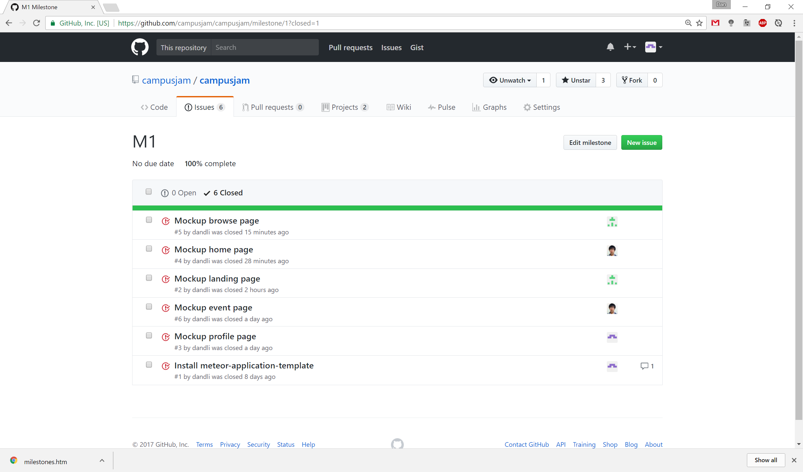

Each issue was implemented in its own branch, and merged into master when completed:

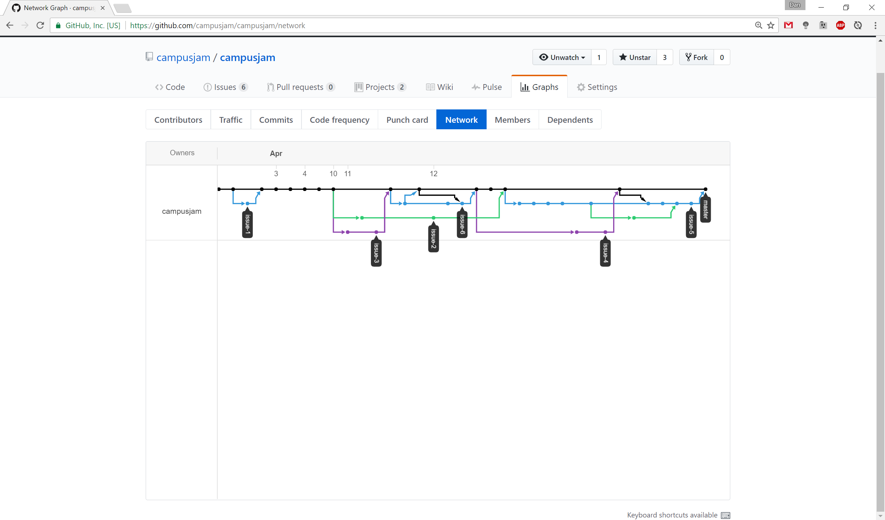

## Milestone 2: UH CAS and Page Functionality

This milestone started on April 14, 2017 and ended on April 27, 2017.

The goal of Milestone 2 is to add the UH CAS login system and to update all of the mockup pages for more functionality.

Milestone 2 was implemented as [Campusj= Jam GitHub Milestone M2](https://github.com/campusjam/campusjam/milestone/2):

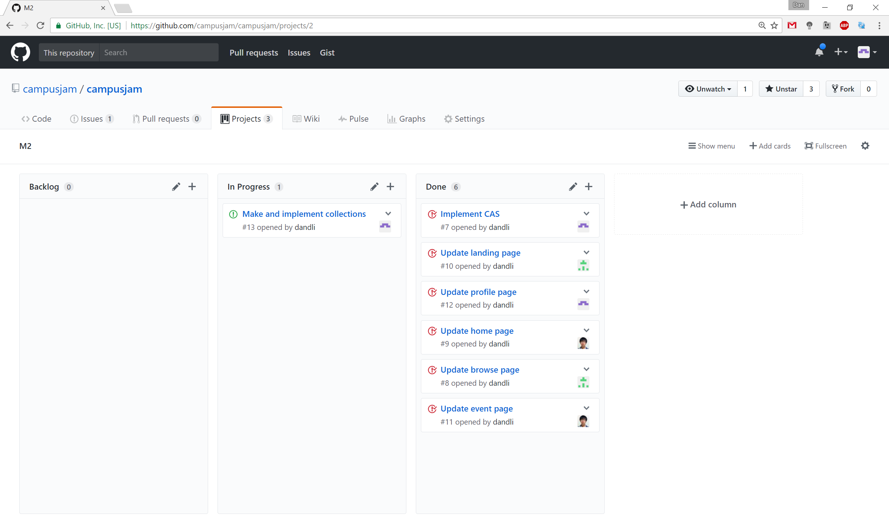

Milestone 2 consisted of seven issues, and progress was managed via the [Campus Jam GitHub Project M2](https://github.com/campusjam/campusjam/projects/2):

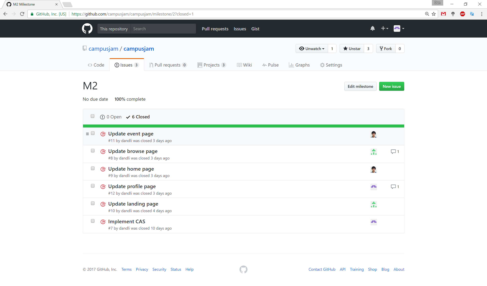

Each issue was implemented in its own branch, and merged into master when completed:

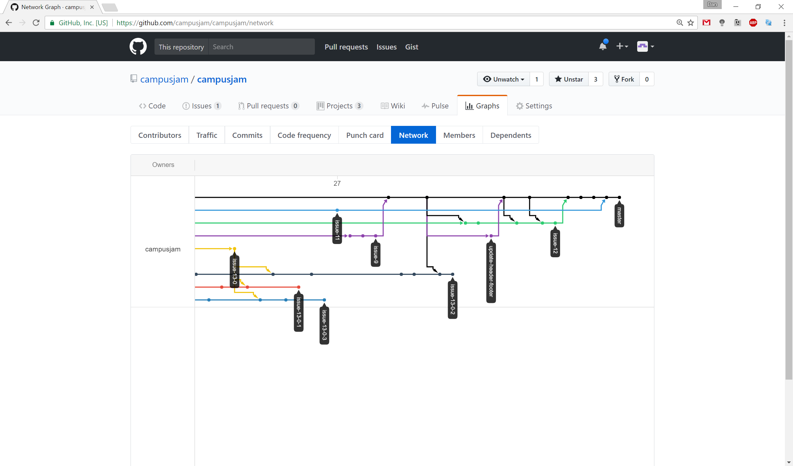

## Milestone 3: Collections and Page Functionality

This milestone started on April 28, 2017 and ended on May 9, 2017.

The goal of Milestone 3 is to implement collections and add even more functionality to all of the pages. Attempts have been made to implement collections in M2 but have not be completed. Therefore, main focus of M3 will be collections. We will also be gathering UH community members to test and give feedback on the app.

Milestone 3 was implemented as [Campus Jam GitHub Milestone M3](https://github.com/campusjam/campusjam/milestone/3):

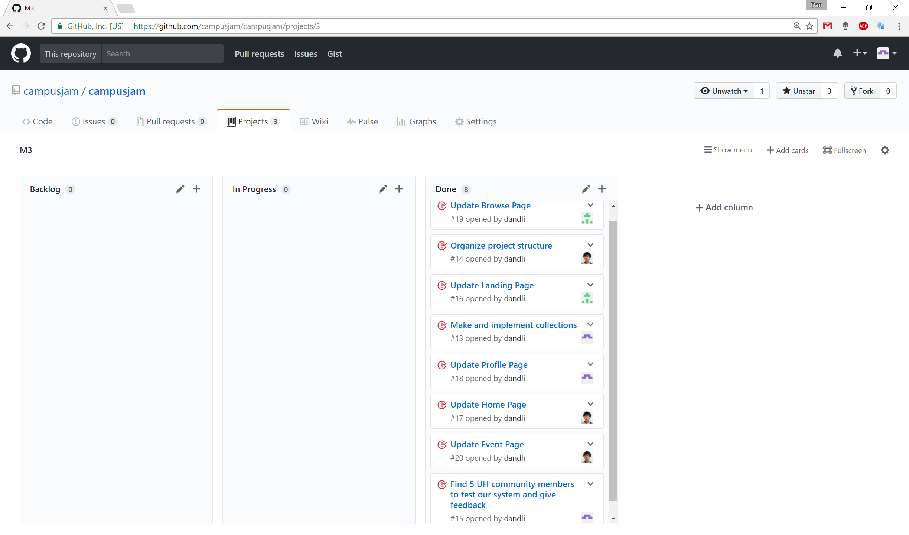

Milestone 3 consisted of eight issues, and progress was managed via the [Campus Jam GitHub Project M3](https://github.com/campusjam/campusjam/projects/3):

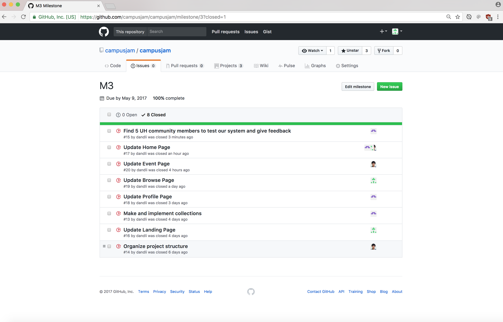

Each issue was implemented in its own branch, and merged into master when completed:

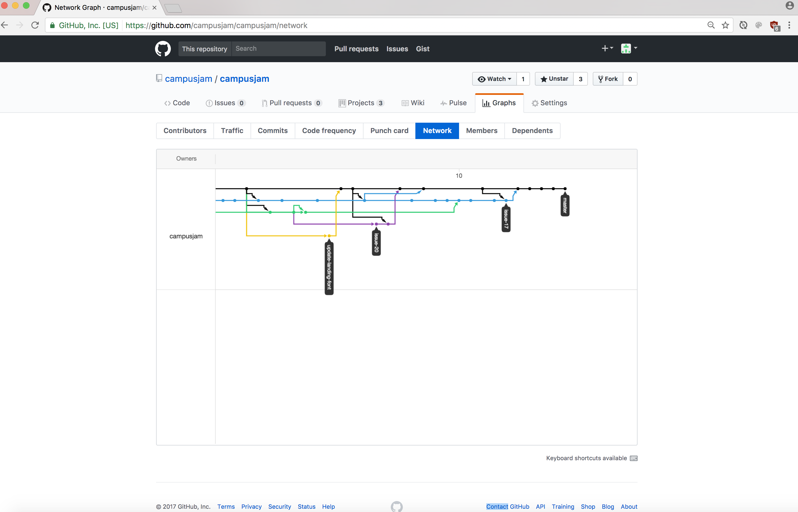
