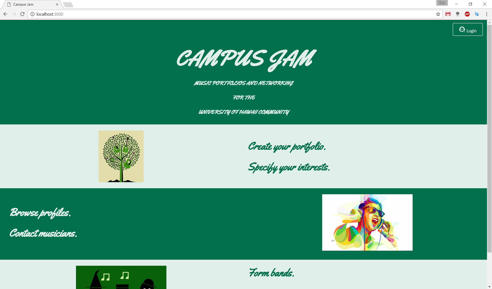
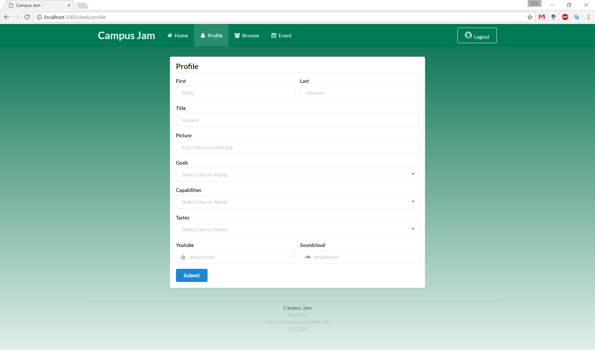

[View on GitHub](https://github.com/campusjam/campusjam)

# Table of contents

* [About Campus Jam](#about-campus-jam)
* [Development history](#development-history)
  * [Milestone 1: Mockup development](#milestone-1-mockup-development)
  * [Milestone 2: UH CAS and Page Functionality](#milestone-2-uh-cas-and-page-functionality)

# About Campus Jam

Campus Jam is a Meteor application providing musical profiles for the University of Hawaii community. When you come to the site, you are greeted a landing page.

The app is running on [Meteor](http://campusjam.meteorapp.com/).

# Development History

The development process for Campus Jam conformed to [Issue Driven Project Management](http://courses.ics.hawaii.edu/ics314f16/modules/project-management/) practices. In a nutshell, development consists of a sequence of Milestones. Milestones consist of issues corresponding to 2-3 day tasks. GitHub projects are used to manage the processing of tasks during a milestone.  

The following sections document the development history of Campus Jam.

## Milestone 1: Mockup development

This milestone started on March 29, 2016 and ended on April 13, 2017.

The goal of Milestone 1 was to create a set of HTML pages providing a mockup of the pages in the system. To simplify things, the mockup was developed as a Meteor app. This meant that each page was a template and that FlowRouter was used to implement routing to the pages.

Mockups for the following five pages were implemented during M1:

Milestone 1 was implemented as [Campusjam GitHub Milestone M1](https://github.com/campusjam/campusjam/milestone/1):

Milestone 1 consisted of six issues, and progress was managed via the [Campusjam GitHub Project M1](https://github.com/campusjam/campusjam/projects/1):

Each issue was implemented in its own branch, and merged into master when completed:

## Milestone 2: UH CAS and Page Functionality

This milestone started on April 14, 2017 and is ongoing.

The goal of Milestone 2 is to add the UH CAS login system and to update all of the mockup pages for more functionality.

Milestone 2 was implemented as [Campusjam GitHub Milestone M2](https://github.com/campusjam/campusjam/milestone/2):

Milestone 2 consisted of six issues, and progress was managed via the [Campusjam GitHub Project M2](https://github.com/campusjam/campusjam/projects/2):

Each issue was implemented in its own branch, and merged into master when completed:
